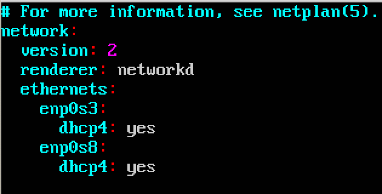

# 实现无人值守Ubuntu安装
* 宿主机：Mac OS X 10.14, Darwin Kernel Version 18.0.0
* 目标机：Ubuntu 18.04.1 LTS （用于制作custom.iso）

### 配置Host-only网卡
* 手动安装好一个Ubuntu 18.04.1虚拟机，开启NAT和Host-only两块网卡。
`sudo vim /etc/netplan/01-netcfg.yaml` 打开配置文件，增加新网卡

`sudo netplan apply` 使修改生效
`ifconfig` 查看正确的网卡信息

* 在目标机上```sudo apt install openssh-server```安装openssh-server，kali上已经装好。

### 配置ssh免密登录
* 修改宿主机的`/etc/ssh/ssh_config`文件，添加
```
Host cuc-svr
hostname 192.168.56.102
user shielding
```

* 在宿主机通过`ssh-keygen -t rsa`生成密钥对
* 将生成的公钥通过`ssh-copy-id -i ~/.ssh/id_rsa.pub cuc-svr`传到虚拟机内
* 执行指令`ssh cuc-svr`，登录到目标ubuntu虚拟机

### 通过准备好的seed文件定制可以自动安装系统的镜像custom.iso

* 在宿主机内下载好ubuntu镜像和准备好的seed文件，通过scp拷贝到目标机：

```bash
scp ~/Downloads/ubuntu-server-autoinstall.seed cuc-svr:~
scp ~/Downloads/ubuntu-18.04.1-server-amd64.iso cuc-svr:~
```

* ssh登录到目标机后，继续执行以下命令：

```bash
# 将传入目标机的文件放到/root/底下
sudo cp ~/ubuntu-18.04.1-server-amd64.iso /root
sudo cp ~/ubuntu-server-autoinstall.seed /root

#以root用户身份
sudo su -

# 创建用于挂载镜像的文件目录
mkdir loopdir

#挂载iso镜像文件到该目录
mount -o loop ubuntu-18.04.1-server-amd64.iso loopdir

# 创建一个工作目录用于克隆光盘内容
mkdir clone

# 同步光盘内容到目标工作目录
# 一定要注意loopdir后的这个/，cd后面不能有/
# -a : --archive archive mode; equals -rlptgoD (no -H,-A,-X) , 表示以递归方式传输文件，并保持所有文件属性
# -v : --verbose increase verbosity 详细模式输出
rsync -av loopdir/ clone

# 卸载iso镜像
umount loopdir

# 进入目标工作目录
cd clone/

# 编辑Ubuntu安装引导界面增加一个新菜单项入口
vim isolinux/txt.cfg
```
* 在isolinux/txt.cfg的***开头***中添加（**注意asciinema的视频里这里错了！**）：

```
label autoinstall
  menu label ^Auto Install Ubuntu Server
  kernel /install/vmlinuz
  append  file=/cdrom/preseed/ubuntu-server-autoinstall.seed debian-installer/locale=en_US console-setup/layoutcode=us keyboard-configuration/layoutcode=us console-setup/ask_detect=false localechooser/translation/warn-light=true localechooser/translation/warn-severe=true initrd=/install/initrd.gz root=/dev/ram rw quiet
```
```
cd ..

#将ubuntu-server-autoinstall.seed拷贝到~/clone/preseed/目录下
cp ubuntu-server-autoinstall.seed ~/clone/preseed/

# 修改isolinux/isolinux.cfg，timeout改为10
vim isolinux/isolinux.cfg

# 重新生成md5sum.txt
cd ~/clone && find . -type f -print0 | xargs -0 md5sum > md5sum.txt

#系统内没有mkisofs
apt install genisoimage

# 封闭改动后的目录到.iso

IMAGE=custom.iso
BUILD=~/clone/

mkisofs -r -V "Custom Ubuntu Install CD" \
            -cache-inodes \
            -J -l -b isolinux/isolinux.bin \
            -c isolinux/boot.cat -no-emul-boot \
            -boot-load-size 4 -boot-info-table \
            -o $IMAGE $BUILD
            
# 将custom.iso拷贝至/usr目录，这样就可以在宿主机通过scp将其拷贝到宿主机了（root目录下的不行）        
cp custom.iso /usr            
            
```

## 过程视频及实验结果视频
* [命令行执行全过程asciinema视频](https://asciinema.org/a/241790)
* [通过custom.iso无人值守安装（b站）](https://www.bilibili.com/video/av49830345/)

## 参考
1. [无人值守安装ISO制作过程示例](https://sec.cuc.edu.cn/huangwei/course/LinuxSysAdmin/chap0x01.exp.md.html#/6/1)