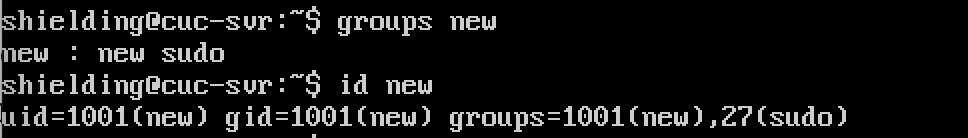
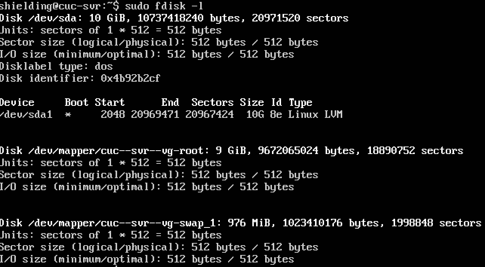
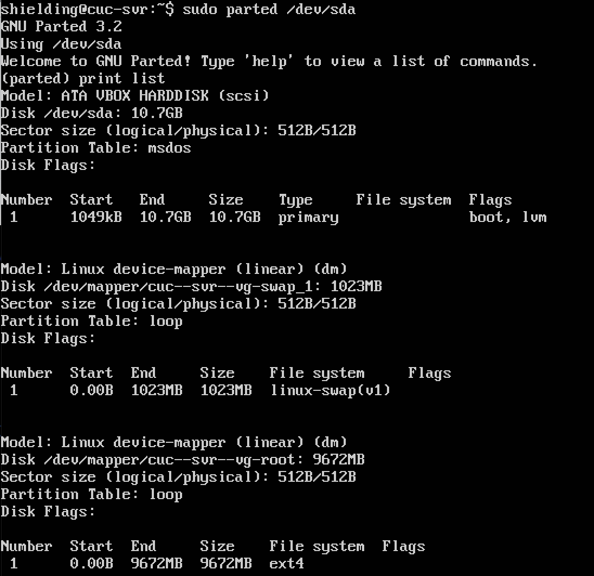
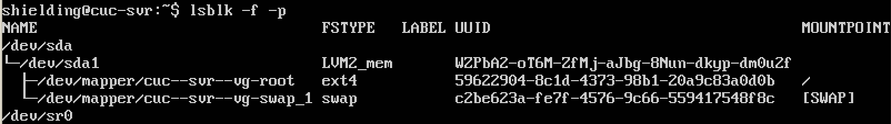
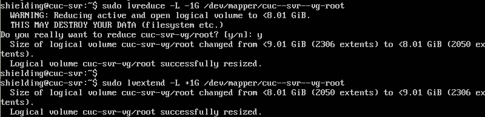

## 实验3

### systemd阮一峰教程
* [命令篇1-4](https://asciinema.org/a/hloR4ZbZGkVFVrlyi512K01Fi)
* [命令篇5-7](https://asciinema.org/a/9lYojj681Qq79kNpbHLjWuIui)
* [应用篇](https://asciinema.org/a/SsXZspIAbf63NQAHrPIIMPXMB)

### 自查清单
* 如何添加一个用户并使其具备sudo执行程序的权限？

```
sudo adduser new
sudo usermod -G sudo new
```

* 如何将一个用户添加到一个用户组？

```
# 查看一共有哪些用户组
groupmod<tab><tab><tab> 或者 sudo cat /etc/group
# 查看用户new在哪些组里
groups new
# 将new用户添加到root用户组
sudo usermod -G root new
# 查看new用户所在的组
id new
```



* 如何查看当前系统的分区表和文件系统详细信息？

```
#使用fdisk查看系统所有硬盘的分区情况
sudo fdisk -l 

#查看某个分区的文件系统详情
sudo parted /dev/sda

```




```
#查看分区表的同时查看文件系统详细信息。
lsblk -f -p
```



* 如何实现开机自动挂载Virtualbox的共享目录分区？

```
sudo vi /etc/systemd/system/mnt-tmp.mount
```

```
[Unit]
Description=vbox shared dir mount script
Requires=network-online.target
After=network-online.service


[Mount]
# 这里的 tmpvbox 是在 Virtualbox 共享文件夹设置里指定的 共享文件夹名称
What=tmpvbox

# 这里的 /mnt/tmp 是挂载目的目录，如果没有，需要事先创建好
Where=/mnt/tmp

# 指定挂载文件系统类型
Type=vboxsf

[Install]
WantedBy = multi-user.target
```

```
sudo vi /etc/systemd/system/mnt-tmp.automount
```

```
[Unit]
Description=vbox shared dir mount script
Requires=network-online.target
After=network-online.service

[Automount]
Where=/mnt/tmp
TimeoutIdleSec=10

[Install]
WantedBy = multi-user.target
```

```
sudo systemctl enable mnt-tmp.automount
# 然后重启系统，当有进程访问到共享目录的挂载点 /mnt/tmp 时，目录会自动挂载.
```


* 基于LVM（逻辑分卷管理）的分区如何实现动态扩容和缩减容量？

```
# 查看系统中硬盘的分区情况
sudo fdisk -l 

#使用如下两条语句对/dev/mapper/cuc-svr--vg-root进行缩容和扩容(先扩容空间不足）
sudo lvreduce -L -1G /dev/mapper/cuc-svr--vg-root
sudo lvextend -L +1G /dev/mapper/cuc-svr--vg-root
```



* 如何通过systemd设置实现在网络连通时运行一个指定脚本，在网络断开时运行另一个脚本？

```
cd /usr/lib/networkd-dispatcher
ls 
# dormant.d no-carrier.d off.d routable.d
# 在4个目录中增添不同的脚本，分别在不同状态时执行
```

* 如何通过systemd设置实现一个脚本在任何情况下被杀死之后会立即重新启动？实现杀不死？

```
# 打开文件
sudo vim /lib/systemd/system/apache2.service

# 修改Restart为always 保存退出

# systemctl status apache2 查看主进程号
# kill 主进程号
# apache2服务仍然存在 配置生效
# Restart=on-failure 比 always用得更多一些
```

## 参考
1. [systemd风格实现自动挂载共享目录](https://asciinema.org/a/8Hw2VByl3NrK7cZr4Wsi3FXSP)
2. [how to mount a virtualbox shared folder at startup](https://askubuntu.com/questions/252853/how-to-mount-a-virtualbox-shared-folder-at-startup)
3. [通过systemd设置实现在网络连通时运行一个指定脚本，在网络断开时运行另一个脚本](https://asciinema.org/a/ND40x8WroOoDwjP2BWiR3ojLI)
4. [https://github.com/CUCCS/2015-linux-public-songyawen/pull/2](https://github.com/CUCCS/2015-linux-public-songyawen/pull/2)