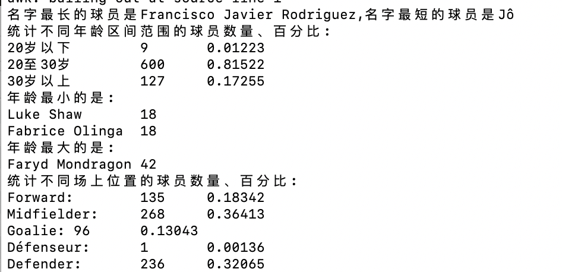

## 实验四

### 任务一

* 用bash编写一个图片批处理脚本，实现以下功能：
	* 支持命令行参数方式使用不同功能
  	* 支持对指定目录下所有支持格式的图片文件进行批处理   **指定目录进行批处理**
  	* 支持以下常见图片批处理功能的单独使用或**组合**使用
  		* 支持对jpeg格式图片进行图片质量压缩
  		* 支持对jpeg/png/svg格式图片在保持原始宽高比的前提下压缩分辨率
  		* 支持对图片批量添加自定义文本水印
		* 支持批量重命名（统一添加文件名前缀或后缀，不影响原始文件扩展名）
		* 支持将png/svg图片统一转换为jpg格式

		
* 借助ImageMagick的命令行工具实现功能。`sudo  apt-get install imagemagick`
* shell脚本中cd命令不生效
	* 原因：
		* 在shell在执行脚本的时候，会创建一个子shell，并在子shell中逐条执行脚本中的指令
		* 子shell会从父shell中继承了环境变量，但是执行后不会改变父shell的环境变量
		* 在子shell中的操作和环境变量不会影响父进程，在执行完shell后又回到了父进程
	* 解决：
		* 通过source执行脚本是直接在当前shell中执行（虽然觉得这样处理也不是很好所以换了不需要cd的写法）

---

### 任务二：用bash编写一个文本批处理脚本，对以下附件分别进行批量处理完成相应的数据统计任务：

 * 2014世界杯运动员数据
	  - 统计不同年龄区间范围（20岁以下、[20-30]、30岁以上）的球员**数量**、**百分比**
	  - 统计不同场上位置的球员**数量**、**百分比**
	  - 名字最长的球员是谁？名字最短的球员是谁？
	  - 年龄最大的球员是谁？年龄最小的球员是谁？

* 注意同一年龄会有多个球员，所以年龄最小和最大会有多个
* 可以在awk中使用`NR>1`的条件或者用sed去掉第一行（列名）以保证统计信息的争取性

* Web服务器访问日志
	  - 统计访问来源主机TOP 100和分别对应出现的总次数
	  - 统计访问来源主机TOP 100 IP和分别对应出现的总次数
	  - 统计最频繁被访问的URL TOP 100
	  - 统计不同响应状态码的出现次数和对应百分比
	  - 分别统计不同4XX状态码对应的TOP 10 URL和对应出现的总次数
	  - 给定URL输出TOP 100访问来源主机

### 参考
1. [TravisCI教程](http://www.ruanyifeng.com/blog/2017/12/travis_ci_tutorial.html)
2. [shell表达式取后缀](https://blog.csdn.net/qq_39584315/article/details/87189114)
3. [ImageMagick官网](https://imagemagick.org/index.php)