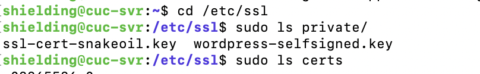

## 实验环境
* ubuntu 18.04

## 实验过程

### 修改主机hosts文件


### 安装nginx
```
sudo apt update
sudo apt install nginx
```


### 安装VeryNginx

```
sudo apt-get update
sudo apt install git

git config --global user.name "Your Name"
git config --global user.email "youremail@domain.com"

git clone https://github.com/alexazhou/VeryNginx.git

cd VeryNginx

sudo apt install libpcre3 libpcre3-dev
sudo apt-get install openssl libssl-dev
sudo apt install zlib1g-dev

```

* 安装好以上依赖后，在通过`sudo python install.py install	`顺利安装VeryNginx之前还会碰到比如如下报错：


* 其实并不用去研究是不是openssl的版本错了、代码自身的问题之类的，再加上下面这句就万事大吉了！

```
sudo apt install libssl1.0-dev
```

```
# 顺利安装
sudo python install.py install
# 修改verynginx配置文件，将监听端口改为8008
sudo vim /opt/verynginx/openresty/nginx/conf/nginx.conf

# 添加nginx用户
sudo adduser nginx
# 启动veryngnix服务
sudo /opt/verynginx/openresty/nginx/sbin/nginx
```

* 初始用户名密码为：verynginx verynginx，登录后页面如下：


```
# 查看端口
netstat -ntpl
```

* 开启verynginx前：


* 开启verynginx后：


* 说明0808端口确实开放并且verynginx可以用，之后不再直接使用它的web站点服务

```
#停止服务
/opt/verynginx/openresty/nginx/sbin/nginx -s stop

#重启服务
/opt/verynginx/openresty/nginx/sbin/nginx -s reload
```

### 安装php扩展和MySQL

```
sudo apt-get install mysql-server
sudo apt-get install php-fpm php-mysql php-curl php-gd php-intl php-mbstring php-soap php-xml php-xmlrpc php-zip
```

### 安装WordPress
* WordPress是使用php语言开发的博客平台，用户可以在支持PHP和MySQL数据库的服务器上架设属于自己的网站。

```
wget https://wordpress.org/wordpress-4.7.zip
unzip wordpress-4.7.zip
cp wordpress/wp-config-sample.php wordpress/wp-config.php
sudo vi /etc/wordpress/config-default.php
ls /var/www/html
# index.html  index.nginx-debian.html
sudo cp -a wordpress/. /var/www/html/wp.sec.cuc.edu.cn
# 修改wordpress文件夹属主及其组为Nginx默认用户
sudo chown -R www-data:www-data /var/www/html/wp.sec.cuc.edu.cn
```


```
# wordpress配置数据库
sudo vim /var/www/html/wp.sec.cuc.edu.cn/wp-config.php
```


* 自签证书


```
# 生成ssl证书
sudo openssl req -x509 -nodes -days 365 -newkey rsa:2048 -keyout /etc/ssl/private/wordpress-selfsigned.key -out /etc/ssl/certs/wordpress-selfsigned.crt
## 其中Common Name和域名要一致
##	Common Name (e.g. server FQDN or YOUR name) []:wp.sec.cuc.edu.cn
sudo vim /etc/nginx/snippets/self-signed.conf
## self-signed.conf内容如下
##    ssl_certificate /etc/ssl/certs/wordpress-selfsigned.crt;
##    ssl_certificate_key /etc/ssl/private/wordpress-selfsigned.key;
```



```
# 在nginx中配置wordpress
sudo vim /etc/nginx/sites-available/default
# 检查配置文件语法错误 
sudo nginx -t
# 启动nginx
sudo /usr/sbin/nginx -c /etc/nginx/nginx.conf
```

* 配置前


* 配置后


* 创建数据库

```
sudo mysql -u root -p
CREATE DATABASE wordpress DEFAULT CHARACTER SET utf8 COLLATE utf8_unicode_ci;
GRANT ALL ON wordpress.* TO 'user'@'localhost' IDENTIFIED BY '123456';
FLUSH PRIVILEGES;
EXIT;
```

* 此时在mac主机输入wp.sec.cuc.eu.cn:8009会自动跳转到wp-admin页面：


* 配置完成后再输入wp.sec.cuc.eu.cn:8009：


## 安装DVWA
```
git clone https://github.com/ethicalhack3r/DVWA
sudo rsync -avP DVWA/ /var/www/html/DVWA
## 配置数据库相关信息
cd /var/www/html/DVWA
cp config/config.inc.php.dist config/config.inc.php
sudo vim /var/www/html/DVWA/config/config.inc.php 
```


* 创建数据库

```
sudo mysql -u root -p
CREATE DATABASE dvwa DEFAULT CHARACTER SET utf8 COLLATE utf8_unicode_ci;
GRANT ALL ON dvwa.* TO 'user'@'localhost' IDENTIFIED BY '123456';
FLUSH PRIVILEGES;
EXIT;
## 重启mysql使配置文件生效
systemctl restart mysql
## 修改DVWA文件夹属主及其组为Nginx默认用户
sudo chown -R www-data:www-data /var/www/html/DVWA
## 在nginx配置文件中配置DVWA
sudo vim /etc/nginx/sites-available/default
## 增添如下内容：
    server {
            listen 8001;
            server_name  dvwa.sec.cuc.edu.cn;

            root /var/www/html/DVWA;
            index index.html index.htm index.php index.nginx-debian.html;

            location / {
                   # try_files $uri $uri/ =404;
                   try_files $uri $uri/ /index.php$is_args$args;
            }

            location ~ \.php$ {
                    include snippets/fastcgi-php.conf;
                    fastcgi_pass unix:/var/run/php/php7.2-fpm.sock;
            }
    }	
```


```
## 重启nginx
sudo nginx -s reload
## 或者重新载入nginx配置文件
sudo /opt/verynginx/openresty/nginx/sbin/nginx -s reload
```

* 访问dvwa.sec.cuc.edu.cn:8001 初始用户名密码为：admin、password，登录后页面如下：


## 完成实验任务

* 在nginx配置文件中，在wordpress和DVWA的监听端口前分别加上127.0.0.1:

```
# 配置verynginx
sudo vim /opt/verynginx/openresty/nginx/conf/nginx.conf
# 加入以下内容，开启443端口用于访问wordpress
server {
        listen  443;
        server_name wp.sec.cuc.edu.cn;
        #this line shoud be include in every server block
        include /opt/verynginx/verynginx/nginx_conf/in_server_block.conf;

        location = / {
            root   html;
            index  index.html index.htm;
        }

        # ssl
        ssl on;
        ssl_certificate /etc/ssl/certs/wordpress-selfsigned.crt;
        ssl_certificate_key /etc/ssl/private/wordpress-selfsigned.key;

}
```

## 参考
1. [在Nginx负载均衡上通过反向代理运行php-fpm的原理详解](http://www.chinacion.cn/article/111.html)
2. [Linux中如何查看某个端口是否被占用](https://www.cnblogs.com/hindy/p/7249234.html)
3. [nginx错误：emerg getpwnam(“www”) failed](https://blog.csdn.net/u012383839/article/details/72875210)
4. [ubuntu16.04安装wordpress](https://www.cnblogs.com/youcong/p/9309197.html)
5. [Nginx的启动、停止与重启](https://www.cnblogs.com/codingcloud/p/5095066.html)