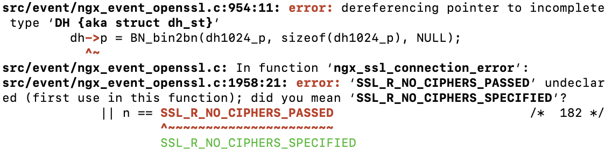

## 实验环境
* ubuntu 18.04

```
nginx -V
nginx version: nginx/1.14.0 (Ubuntu)
built with OpenSSL 1.1.0g  2 Nov 2017
```


## 实验过程

### 修改主机hosts文件


### 安装nginx
```
sudo apt update
sudo apt install nginx
```


### 安装VeryNginx

```
sudo apt-get update
sudo apt install git

git config --global user.name "Your Name"
git config --global user.email "youremail@domain.com"

git clone https://github.com/alexazhou/VeryNginx.git

cd VeryNginx

sudo apt install libpcre3 libpcre3-dev
sudo apt-get install openssl libssl-dev
sudo apt install zlib1g-dev

```

* 安装好以上依赖后，在通过`sudo python install.py install	`顺利安装VeryNginx之前还会碰到比如如下报错：



* 其实并不用去研究是不是openssl的版本错了、代码自身的问题之类的，再加上下面这句就万事大吉了！

```
sudo apt install libssl1.0-dev
```

```
# 顺利安装
sudo python install.py install
# 修改verynginx配置文件，将监听端口改为8008
sudo vim /opt/verynginx/openresty/nginx/conf/nginx.conf

# 添加nginx用户
sudo adduser nginx
# 启动veryngnix服务
sudo /opt/verynginx/openresty/nginx/sbin/nginx
```


```
# 查看端口
netstat -ntpl
```

* 开启verynginx前：


* 开启verynginx后：


让 Nginx 只监听本地，用 VeryNginx 进行反向代理（仅开放 VeryNginx 监听的 80 端口）

在nginx配置wordpress服务（配置在127.0.0.1:某一端口）


配置verynginx反向代理

经代理访问进行wordprss安装

### 安装PHP和MySQL

```
sudo apt-get install mysql-server
sudo apt-get install php-fpm php-mysql php-gd zlib
```

### 安装WordPress
* WordPress是使用PHP语言开发的博客平台，用户可以在支持PHP和MySQL数据库的服务器上架设属于自己的网站。

```
# 创建软链接到web根目录
sudo ln -s /usr/share/wordpress /var/www/html/wordpress
# 复制一份默认的配置文件，并修改相应字段
sudo cp /usr/share/wordpress/wp-config-sample.php /etc/wordpress/config-default.php
sudo vi /etc/wordpress/config-default.php
```

## 参考
1. [在Nginx负载均衡上通过反向代理运行php-fpm的原理详解](http://www.chinacion.cn/article/111.html)
2. [Linux中如何查看某个端口是否被占用](https://www.cnblogs.com/hindy/p/7249234.html)
3. [nginx错误：emerg getpwnam(“www”) failed](https://blog.csdn.net/u012383839/article/details/72875210)
4. [ubuntu16.04安装wordpress](https://www.cnblogs.com/youcong/p/9309197.html)